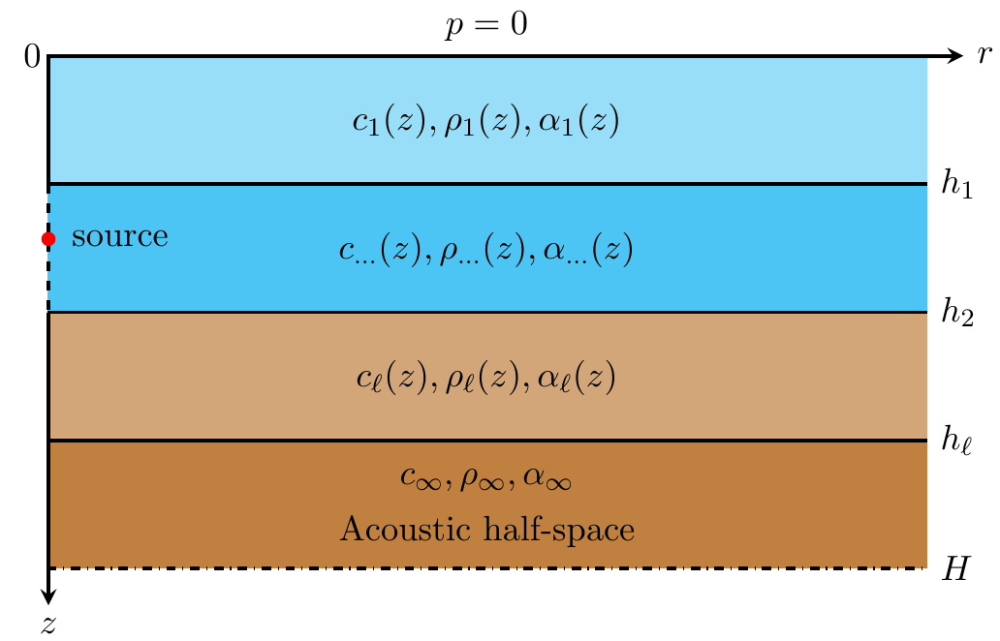

**`NM_CT_readme`, Jul. 5, 2020, Houwang Tu, National University of Defense Technology**

The program `NM_CT.m` computes the range-independent modal acoustic field in
Fig.1 using the Chebyshev-Tau spectral method (`NM_CT`). The method is
described in the article (H. Tu, Y. Wang, Q. Lan et al., A Chebyshev-Tau
spectral method for normal modes of underwater sound propagation with a
layered marine environment, https://doi.org/10.1016/j.jsv.2020.115784).
We have developed program in Fortran version (`NM_CT.f90`) and Matlab
version (`NM_CT.m`), respectively. Both versions of the program use the
same input file "`input.txt`", '`ReadEnvParameter`' function/subroutine is used
to read "`input.txt`" file. User can make changes to "`input.txt`" for the
desired calculation. It is worth mentioning that the Fortran version of
the program calls the subroutine '`zgeev()`' in the Lapack (a numerical
library) to solve the eigenvalues of the complex matrix. Both the Matlab
and Fortran versions of the program will eventually generate the same
format of the binary sound field file "`tl.bin`", and the
`plot_binary_tl.m` program can be used to read the sound field binary
data and plot.

The "`input.txt`" file contains the parameters defining the modal
calculation. See the following example:

```
Example8                          ! casename
20                                ! Nw (truncation order of water column)
20                                ! Nb (truncation order of bottom sediment)
3500.0                            ! cpmax (maximum phase speed limit)
50.0                              ! freq (frequency of source)
36.0                              ! zs (depth of source)
10.0                              ! zr (depth of special receiver)
3500.0                            ! rmax (receiver ranges(m))
1                                 ! dr (discrete step in horizontal direction)
50.0                              ! interface (thickness of water column)
100.0                             ! Hb (thickness of ocean)
0.1                               ! dz (discrete step in depth direction)
A                                 ! Lowerboundary (rigid/free/halfspace lower boundary condition)
40                                ! tlmin (minimum value of TL in colorbar)
70                                ! tlmax (maximum value of TL in colorbar)
2                                 ! nw (profiles' points in water column)
2                                 ! nb (profiles' points in bottom sediment)
    0.0 1500.0  1.0   0.0         ! depw cw rhow alphaw
   50.0 1500.0  1.0   0.0
   50.0 1800.0  1.5   1.5         ! depb cb rhob alphab
  100.0 1800.0  1.5   1.5
  100.0 2000.0  2.0   2.0         ! sound speed, density and attenuation of semi-infinite space

```

The "`input.txt`" file include:

*  `casename` is the name of current example,

* `Nw` (the number to truncated
  order of water column), 

* `Nb` (the number to truncated order of bottom
  sediment). 

  `Nw` and `Nb` may be equal or unequal. Generally speaking, the
  more complicated the shape of the sound speed profile, the more `Nw` and
  `Nb` are needed to accurately fit.

* `cpmax` is the maximum phase speed limit, which used to determine how many
  modes are accumulated in the final synthesized sound field, generally
  set by the user according to experience (m/s). 

* `freq` (frequency of sound
  source, Hz), 

* `zs` (the depth of source, m), 

* `zr` (depth of a special
  receiver, user used to specify to draw the transmission loss curve of
  arbitrary depth, m), 

* `rmax` (the maximum range of horizontal direction,
  m), 

* `dr` (horizontal discrete step, m),

*  `interface` (thickness of water column, m),

* `Hb` (thickness of ocean, m), `interface` must less than `Hb`, 

* `dz` (discrete step size in
  depth direction, m),

*  `Lowerboundary` (User used to specify whether the seabottom
  boundary condition is perfectly free 'V', perfectly rigid 'R' or semi-infinite space 'A'), 

* `tlmin`
  and `tlmax` are the minmum and maximum value transmission loss,
  respectively, which used to determine the color range of the output
  transmission loss graph, `tlmin` must less than `tlmax`.

* `nw` and `nb` are the amount of environmental profile data in water
  column and bottom sediment respectively. 

  There are two tables of
  environmental parameter: one for the water column and one for the bottom
  sediment, both of their units are depth(m), speed(m/s),
  density(g/cm$^3$) and attenuation (dB/wavelength), with `nw` and `nb`
  points in each. It is necessary that `depw(nw)=depb(1)` where the
  density usually has a discontinuity. The first entry `depw(1)=0` is the
  free surface. The last entry `depb(nb)=H` determines the total thickness
  of the waveguide. 

  

  Figure 1. Layered marine environment.

  The plots resulting from the above dialog are as
  follows:


Figure 2. Complex horizontal wavenumbers.


Figure 3. Mode number 2 versus depth.


Figure 4. Transmission loss versus range for a receiver at a depth of
100 meters.


Figure 5. A colorful plot of transmission loss, range versus depth.
